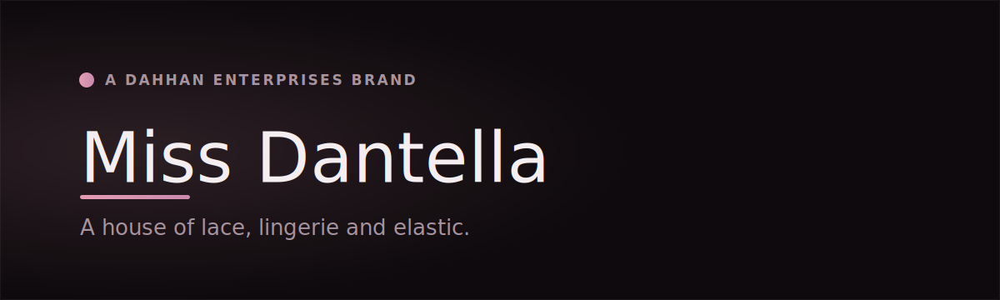

  

  
  
  

# Miss Dantella

> **A house of lace, lingerie and elastic.**
> *Texture is the subject.*

Miss Dantella is a **Dahhan Enterprises brand** crafting women's lingerie, lace, elastic and accessories for boutiques, retailers and B2B buyers — alongside direct retail. A 35+ year textile house operating from Türkiye, serving regional and international buyers, with a production and supply network connected to Syria, Türkiye and Egypt.

Every collection begins with the fibre — its weight, its stretch, its hand — and works across lace, embroidery and elastic. The site is a B2B catalog and a brand stage, never a shopping cart.

## Capabilities

- **Lingerie & lace** — women's lingerie, lace and trims
- **Elastic & accessories** — elastics, galloons and finishing components
- **Textile selection** — across lace, embroidery and elastic
- **Private‑label production** — enquiries welcome and discussed privately

Wholesale pricing is shared on request, minimum order quantities vary by order type, and lead times are confirmed after enquiry. Compliance and quality documentation is shared with qualified buyers on request.

## Tech stack

  
  
  
  
  
  
  
  

Next.js 16 (App Router, RSC) · React 19 · TypeScript 6 · Tailwind CSS v4 · Framer Motion · Directus CMS · PostgreSQL + better-auth (invite-only B2B portal) · multilingual (EN / TR / AR) · self-hosted behind Caddy + Cloudflare. An editorial design system built around fibre-first craft.

## Links

- 🌐 **Live:** [www.missdantella.com](https://www.missdantella.com) &nbsp;·&nbsp; 🟡 *Launching soon*
- 🏛️ **Group on GitHub:** [M1D0-Technologies](https://github.com/M1D0-Technologies)
- 🧵 **Group parent:** [Dahhan Enterprises](https://github.com/M1D0-Technologies/dahhan-enterprises)
- ✉️ **Enquiries:** info@missdantella.com

---

Miss Dantella — a **Dahhan Enterprises** brand · built and operated by **M1D0 Technologies**. Documentation-only showcase — product source is private. © 2026 Dahhan Enterprises LLC — M1D0 Technologies, Dahhan Industries, Miss Dantella and affiliated brands. All rights reserved.
